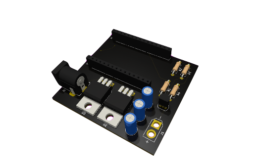
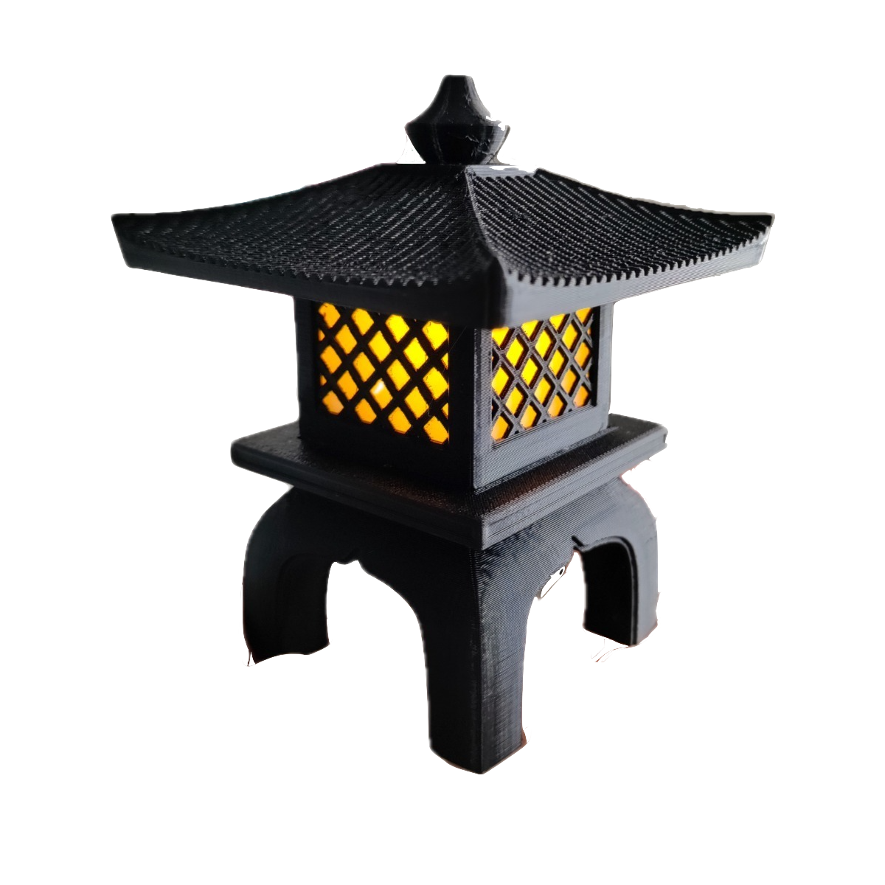
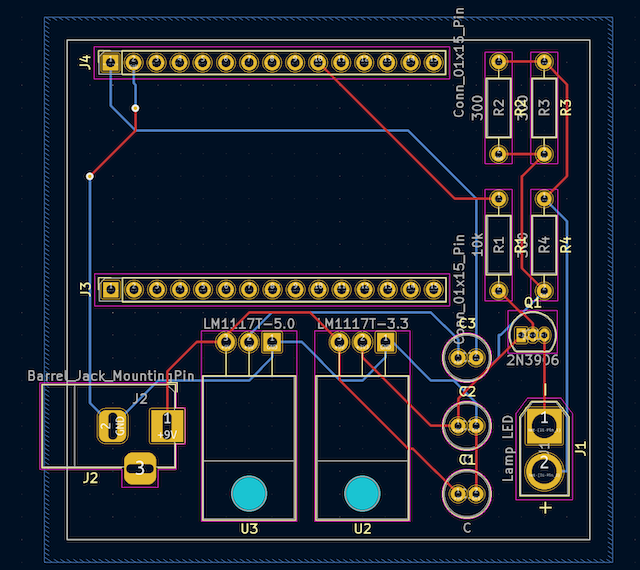

# Lamp Controller with Matter

## Overview

This project is a smart lamp controller designed for a 3V3 3D printed lamp. It utilizes an ESP32 microcontroller and integrates seamlessly with Apple's HomeKit ecosystem. The project consists of both software and hardware components, making it a complete solution for controlling the lamp remotely.

## Software

Refer to [Matter-Lamp-Firmware](https://github.com/vinepb/Matter-Lamp-Firmware).

## Hardware

The hardware component of ths project was designed using [KiCad](https://www.kicad.org) and includes a schematic and a PCB layout.

### PCB Layout

### List of Materials

| Component           | Quantity | Footprint                                        |
|---------------------|----------|--------------------------------------------------|
| Resistor 10k Ohm    | 1        | Resistor_THT:R_Axial_DIN0207_L6.3mm_D2.5mm_P10.16mm_Horizontal |
| Resistor 300 Ohm    | 3        | Resistor_THT:R_Axial_DIN0207_L6.3mm_D2.5mm_P10.16mm_Horizontal |
| Transistor 2N3906   | 1        | Package_TO_SOT_THT:TO-92_Inline                |
| Capacitor 10uF      | 3        | Capacitor_THT:C_Radial_D5.0mm_H11.0mm_P2.00mm |
| Regulator LM1117T 3V3 | 1      | Package_TO_SOT_THT:TO-220-3_Horizontal_TabDown |
| Regulator LM1117T 5V | 1       | Package_TO_SOT_THT:TO-220-3_Horizontal_TabDown |
| ESP32-WROOM-32      | 1        | DEVKIT V1                                        |
| Jack P4 Female      | 1        | Connector_BarrelJack:BarrelJack_Horizontal_3pin |
| 15x Pin Socket       | 2        | 2.54mm vertical                                  |
| Lamp Connector      | 1        | Connector_AMASS_XT30U-F_1x02_P5.0mm_Vertical  |
| 1m Red AWG 20 Cable   | 1        | -                                                |
| 1m Black AWG 20 Cable | 1        | -                                                |
| 9VDC P4 Power Supply  | 1        | -                                                |
